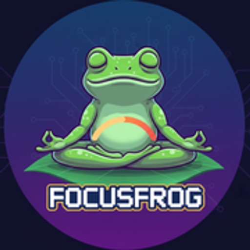
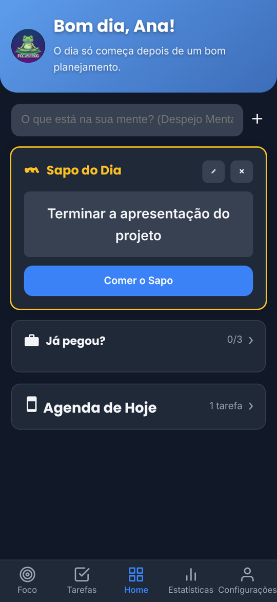
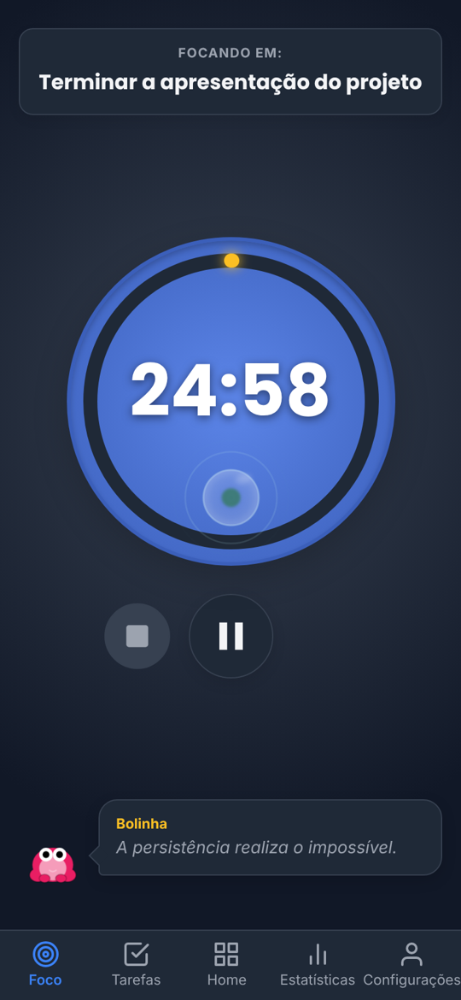
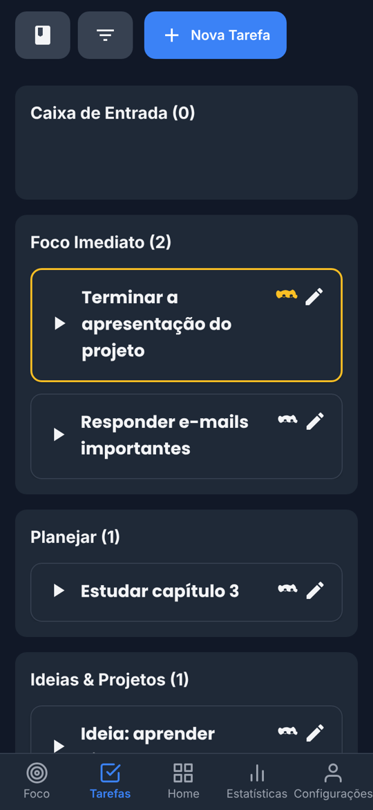
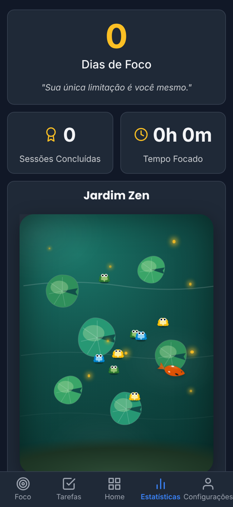

<div align="center">



# FocusFrog

**O app que responde a pergunta mais difícil do dia: _“o que eu faço agora?”_**

Escolha o seu **Sapo do Dia**, foque com o cronômetro e veja a sua **Lagoa Zen** ganhar vida a cada tarefa concluída.

[](https://focusfrog.netlify.app)
&nbsp;
[](https://focusfrog.netlify.app)
&nbsp;
[](https://www.instagram.com/focus.frog)


</div>

<p align="center">
  
  
  
  
</p>

---

## Por que existe

Listas de tarefas costumam virar mais uma fonte de ansiedade: tudo parece
urgente e nada começa. O FocusFrog parte de uma ideia simples — **comer o
sapo**: fazer primeiro a tarefa que mais importa — e transforma isso num
ciclo curto, visual e recompensador.

```
Escolher  →  Começar  →  Focar  →  Concluir  →  Evoluir
```

Pensado pra quem tem dificuldade de começar, se distrai fácil ou trava diante
de listas longas — incluindo muitas pessoas com TDAH. *(O FocusFrog é um app
de foco e organização, não um tratamento.)*

## O que ele faz

| | |
|---|---|
| 🐸 **Sapo do Dia** | Uma tarefa por dia em destaque. Um toque e o foco começa. |
| 🧩 **Passos pequenos** | Quebre tarefas grandes até o primeiro passo ficar óbvio. |
| ⏱️ **Foco com Pomodoro** | Cronômetro ligado à tarefa, com notificação ao vivo e aviso no fim — mesmo com o celular bloqueado. |
| 🛡️ **Foco limpo** | Saiu pra outro app no meio do foco? O sapinho te cutuca. O sapo só nasce se você ficou de verdade. |
| 🌿 **Lagoa Zen** | Cada foco concluído traz um sapo. Eles pulam, se fundem, ganham raridade e vão pro seu Álbum. |
| ⭐ **Mascote** | Escolha um sapo favorito, dê um nome e ele te acompanha no cronômetro. |
| 🗂️ **Matriz de prioridades** | Caixa de Entrada, Foco Imediato, Planejar e Ideias — sem pensar demais. |
| 🔁 **Rotinas e alarmes** | Transforme foco em hábito com lembretes no horário. |
| 🎒 **Widget "Já pegou?"** | Checklist de saída de casa direto na tela inicial. |
| 🔒 **Local-first** | Funciona sem conta e sem internet. Os dados ficam no seu celular. |
| ☁️ **Conta opcional** | Entre com Google ou Facebook pra guardar tudo na nuvem e trocar de celular sem perder nada *(em breve, 1.5.0)*. |

## Baixar

O FocusFrog está em teste aberto para Android. Baixe o APK mais recente em
**[focusfrog.netlify.app](https://focusfrog.netlify.app)**, o site oficial,
com o passo a passo de instalação. O próprio app avisa quando sai uma versão nova.

---

## Para desenvolvimento

> O código é publicado para consulta. **Uso, cópia e distribuição exigem
> autorização** — veja [Licença](#licença).

### Stack

React 18 · TypeScript · Vite · Framer Motion · Capacitor 7 (Android) ·
Java (serviço de foco, widget, monitor de distração) · Supabase (sync opcional)

### Rodando local

```bash
cp .env.example .env      # preencha as chaves do Supabase
npm ci
npm run dev               # versão web em http://localhost:5173
```

### Gerando o APK

Pré-requisitos: JDK 21 e Android SDK 35. A chave de assinatura fica **fora do
repositório** (`android/keystore.properties` + `android/app/*.jks`).

```bash
npm run build && npx cap sync android
cd android && ./gradlew assembleDebug
# APK em android/app/build/outputs/apk/debug/
```

### Estrutura

```
src/
├── screens/          Home, Foco, Tarefas, Estatísticas, Configurações
├── components/
│   ├── zen/          Lagoa Zen: sapos, nenúfares, peixes, viveiro, álbum
│   ├── tour/         Tutorial interativo
│   └── modals/       Tarefa, rotina, seleção do Sapo do Dia
├── context/          Estado: tarefas, pomodoro, lagoa, usuário
└── utils/            Datas, espécies, aviso de nova versão
android/app/src/main/java/com/focusfrog/app/
├── PomodoroForegroundService.java   cronômetro na notificação
├── FocusDistractionMonitor.java     foco limpo
└── ChecklistWidget*.java            widget "Já pegou?"
site/                 site oficial (focusfrog.netlify.app) — ver site/README.md
supabase/migrations/  banco da sincronização opcional
docs/                 propriedade intelectual, prints
```

### Fluxo de trabalho

Branches `main` (versões publicadas, com tag) e `develop` (integração), com
`feature/`, `fix/` e `chore/` para cada mudança, commits no padrão
[Conventional Commits](https://www.conventionalcommits.org/pt-br/) e versões
em [SemVer](https://semver.org/lang/pt-BR/). Detalhes em
[`CONTRIBUTING.md`](CONTRIBUTING.md); histórico em [`CHANGELOG.md`](CHANGELOG.md).

## Licença

**Proprietária — todos os direitos reservados.** O código está público para
consulta; copiar, modificar, publicar ou usar o nome, a marca, os sapos e a
arte do FocusFrog exige autorização por escrito. Veja [`LICENSE`](LICENSE) e
[`docs/PROPRIEDADE-INTELECTUAL.md`](docs/PROPRIEDADE-INTELECTUAL.md).

<div align="center">
<br />

Feito com 💚 por **Igor Viana** · site e app desenvolvidos com a **[Online Já Tech](https://onlinejacwb.com.br)** — sites e apps para pequenos negócios em Curitiba.

[Site oficial](https://focusfrog.netlify.app) · [Instagram](https://www.instagram.com/focus.frog) · [Novidades](CHANGELOG.md)

</div>
